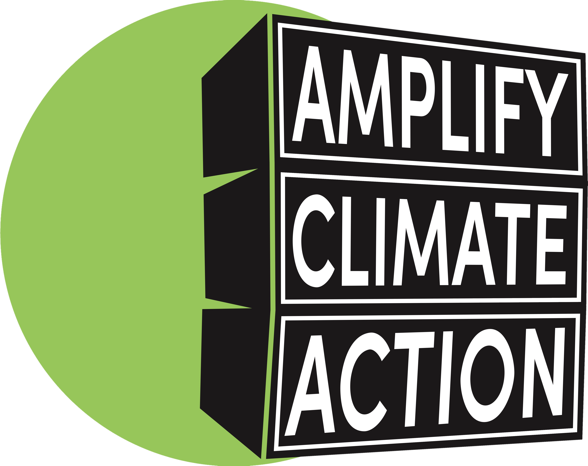

# AMPLIFY Operations Platform

**Internal Operations System for Curating and Verifying Grassroots Climate Organizations**

[](https://nextjs.org/)
[](https://supabase.com/)
[](https://tailwindcss.com/)
[](https://mdedb.vercel.app/)
[](LICENSE)
[](https://www.musicdeclares.net/us/campaigns/mde-us-amplify-program)

## Table of Contents

- [Description](#description)
- [User Contract](#user-contract)
- [Enforcement Model](#enforcement-model)
- [Features](#features)
- [Scoring System](#scoring-system)
- [Tech Stack](#tech-stack)
- [Architecture](#architecture)
- [Out of Scope](#out-of-scope)
- [Architecture Decisions](#architecture-decisions)
- [Known Constraints](#known-constraints)
- [Installation](#installation)
- [Deployment](#deployment)
- [Contributing](#contributing)
- [License](#license)
- [Questions](#questions)

---

## Description

A sophisticated platform to catalog, score, and assess grassroots climate organizations using a comprehensive 13-criteria rubric. Features an enterprise-grade admin dashboard with real-time validation, automated metadata fetching, and intelligent scoring recommendations. Built to support transparent, collective, and scalable climate action aligned with Music Declares Emergency's AMPLIFY program.

> 
> <a href="https://www.musicdeclares.net/us/campaigns/mde-us-amplify-program" style="font-weight:bold; font-size:1.1em; vertical-align:middle;">AMPLIFY</a> empowers artists with easy-to-use tools to move their fans to take meaningful climate actions through high-impact, vetted partners.

---

## User Contract

```gherkin
As an MDE Organizer
I want a database of grassroots climate organizations with actionable CTAs
So that I can point artists to the right organizations based on geography, issue, and impact
```

### Primary Acceptance Criteria

- ✅ Search organizations by location (country/region)
- ✅ Retrieve organizations with verified contact info and links
- ✅ Filter by organizational impact metrics and issue focus
- ✅ Restrict artist visibility to approved, verified organizations only
- ✅ Admin users can assess, comment, and approve/reject submissions
- ✅ Data integrity: unverified organizations invisible to public queries

---

## Enforcement Model

This contract is enforced at multiple layers:

### **Data Layer** - [app/models/](app/models/)
- Organization interface defines required fields: `name`, `contact`, `website`, `country`, `impact_focus`
- Score aggregation ensures minimum quality thresholds before visibility gates

### **Permission Layer** - [app/utils/supabase/middleware.ts](app/utils/supabase/middleware.ts)
- JWT token validation guards `/admin` from unauthenticated access
- Row Level Security (RLS) policies enforce role-based data visibility

### **Visibility Layer** - [app/admin/page.tsx](app/admin/page.tsx#L1)
- `status` field gates organization visibility: `approved | rejected | pending`
- Artist-facing queries filter: `WHERE status = 'approved' AND verified_at IS NOT NULL`
- Admin view shows all statuses for decision-making

### **Verification Pipeline** - [app/api/metadata/route.ts](app/api/metadata/route.ts)
- Website metadata fetching validates domain ownership and legitimacy
- Favicon extraction and HTTP status checking prevents dead links from appearing
- Failed metadata marks organization as requiring manual review

### **Assessment Layer** - [app/components/ScoringSection/index.tsx](app/components/ScoringSection/index.tsx)
- 13-criteria rubric enforces structured evaluation before approval
- Minimum score threshold prevents low-quality orgs from approval
- Comments required for rejection justify blocking decisions

---

## Features

**Organization Management**
- Add, edit, approve/reject climate organizations with inline editing
- Real-time validation with visual feedback and error handling
- Inline editing for organization details with validation
- Status management: approve, reject, or mark as pending
- Timestamped edits with admin ID tracking

**Assessment & Scoring**
- 13-criteria assessment with real-time recommendations
- Structured evaluation enforces quality thresholds before approval
- Comments system required for rejection decisions
- Visual progress tracking with score summaries
- Minimum score threshold prevents low-quality approvals

**Data Integrity & Verification**
- Automatic website metadata fetching with favicon extraction
- HTTP status checking prevents dead links from appearing
- Email validation and parsing with multiple email support
- Failed metadata marks organization as requiring manual review
- Verification pipeline enforces domain ownership and legitimacy

**Security & Access Control**
- JWT-based admin authentication with secure routing
- Row Level Security (RLS) for database-level data protection
- Input sanitization with comprehensive data validation
- Role-based visibility: admin view shows all statuses, artist queries filter to approved + verified only

**Search, Filter & Navigation**
- Multi-criteria filtering by status, continent, score range, and website status
- Real-time search across organization names and details
- Sorting options: by name, score, status, country, or recent activity
- Filter persistence maintains state across sessions

**User Experience**
- Glass morphism design with backdrop blur effects
- Regional theming with colors based on organization location
- CSS-based animations for transitions and micro-interactions
- Loading states, progress bars, and error handling
- ARIA labels, keyboard navigation, and screen reader support

---

## Tech Stack

### **Frontend**
- **Next.js** with App Router and Server Components
- **React** with TypeScript for type safety
- **Tailwind CSS** with custom glass morphism utilities
- **CSS Animations** - Custom CSS transitions and animations
- **Custom Hooks** - Specialized hooks for organizations, scoring, and metadata

### **Backend**
- **Supabase** - PostgreSQL database with real-time subscriptions
- **Row Level Security (RLS)** - Database-level security policies
- **Auth** - JWT-based authentication with custom claims
- **Edge Functions** - Serverless functions for metadata processing

### **Development**
- **TypeScript** - Full type safety across the application
- **ESLint & Prettier** - Code formatting and linting
- **Custom Hooks** - Reusable state management logic
- **Component Architecture** - Modular, testable components

---

## Architecture

The application follows a **clean architecture** pattern with clear separation of concerns:

```bash
project-root/
├── app/                    # Next.js App Router
│   ├── admin/              # Admin dashboard page
│   │   ├── layout.tsx
│   │   └── page.tsx        # Admin dashboard component
│   ├── api/                # API routes and serverless functions
│   │   └── metadata/
│   │       └── route.ts
│   ├── components/         # Reusable UI components
│   │   ├── AddOrganizationModal/
│   │   │   └── index.tsx
│   │   ├── AdminHeader/
│   │   │   └── index.tsx
│   │   ├── CustomDropdown/
│   │   │   └── index.tsx
│   │   ├── Icons/
│   │   │   └── index.tsx
│   │   ├── OrganizationCard/
│   │   │   └── index.tsx
│   │   └── ScoringSection/
│   │       └── index.tsx
│   ├── hooks/              # Custom React hooks
│   │   ├── useOrganizations.ts
│   │   ├── useScoring.ts
│   │   └── useWebsiteMetadata.ts
│   ├── login/              # Authentication pages
│   │   └── page.tsx        # Login page component
│   ├── utils/              # Logic utilities
│   │   ├── supabase/       # Supabase client configuration
│   │   │   ├── client.ts
│   │   │   ├── middleware.ts
│   │   │   └── server.ts
│   │   ├── motion.ts
│   │   ├── orgUtils.ts
│   │   ├── scoring.ts
│   │   ├── selectOptions.ts
│   │   └── validation.ts
│   ├── favicon.ico
│   ├── globals.css         # Global styles
│   ├── layout.tsx          # Root layout component
│   └── page.tsx            # Homepage component
├── models/                 # TypeScript interfaces
│   ├── org.ts              # Organization interface
│   └── orgWithScore.ts     # Organization with scoring interface
├── public/                 # Static assets
├── .env                    # Environment variables
├── .gitignore
├── eslint.config.mjs
├── LICENSE
├── middleware.ts           # Supabase root middleware
├── next.config.ts
├── package-lock.json
├── package.json
├── postcss.config.mjs
├── README.md
├── tailwind.config.js
└── tsconfig.json
```

### **App Router Structure Details**

**Directory Overview:**
- `app/` – Main Next.js application code (pages, components, hooks, utilities)
- `app/utils/` – Utility functions and Supabase client config
- `models/` – TypeScript interfaces and types
- `public/` – Static assets (images, favicon, etc.)
- `.env` – Environment variables (not committed)
- `middleware.ts` – Next.js middleware for Supabase

#### **Pages & Routes**
- **`/admin`** - Admin dashboard for organization management
- **`/login`** - Authentication page for admin access

#### **API Routes**
- **`/api/metadata/*`** - Website metadata extraction

#### **Component Architecture**
- **AddOrganizationModal** - Form modal with comprehensive validation and dropdown components
- **AdminHeader** - Header with compact layout, filters, search, and real-time stats
- **CustomDropdown** - Beautiful glass dropdown components with search and animations
- **Icons** - Custom SVG and Phosphor Icons
- **OrganizationCard** - Rich cards with glass effects, inline editing, and regional theming
- **ScoringSection** - Streamlined 13-criteria scoring interface with progress tracking

#### **Custom Hooks**
- **useOrganizations** - Organization CRUD and state management
- **useScoring** - Scoring logic and calculations
- **useWebsiteMetadata** - Automatic metadata fetching and caching

#### **Utility Functions**
- **supabase/client.ts** - Supabase client configuration for client-side usage
- **supabase/middleware.ts** - Supabase middleware utilities
- **supabase/server.ts** - Supabase client configuration for server-side usage
- **motion.ts** - Animation and motion utility functions
- **orgUtils.ts** - Regional theming, color logic, and URL validation
- **scoring.ts** - Scoring criteria and recommendation logic
- **selectOptions.ts** - Dropdown and select menu options
- **validation.ts** - Field validation with real-time feedback

### **Key Architectural Principles**
- **Single Responsibility** - Each component/hook has one clear purpose
- **Separation of Concerns** - Data, UI, and business logic are separated
- **Reusability** - Components can be used across different contexts
- **Type Safety** - Comprehensive TypeScript coverage
- **Performance** - Optimized re-renders and efficient state management

---

## Out of Scope

The following are explicitly NOT solved by this project:

- **Organization self-submission** - All organization submissions are manually reviewed and added by admins. Public users cannot submit directly. Ensures verification discipline for each entry.
- **Automated organization vetting** - Assessment requires human judgment. AI scoring rejected as insufficient for trust decisions.
- **Real-time campaign analytics** - System tracks what artists choose; impact measurement outside scope.
- **Multi-language support** - Currently English-only. Localization deferred pending user research.
- **Bulk data import** - CSV/JSON import deliberately excluded. Maintains verification discipline for each entry.

---

## Architecture Decisions

### **Problem: Real-time data integrity vs. simplicity**
- **Option A** - Event-driven architecture with message queue (Kafka, Bull)
- **Option B** - Supabase real-time subscriptions with RLS policies (chosen)
- **Why B:** Stateless, built-in, enforces security at DB layer. Message queue adds operational complexity without solving the core problem at this scale.

### **Problem: Auth strategy for small team**
- **Option A** - Custom JWT + session server
- **Option B** - Firebase Auth
- **Option C** - Supabase Auth with @supabase/ssr (chosen)
- **Why C:** PostgreSQL-native, SSR-friendly, RLS integrates seamlessly. Firebase would force NoSQL semantics incompatible with relational verification model.

### **Problem: Metadata freshness without polling**
- **Option A** - Scheduled cron job (systemd, external service)
- **Option B** - On-demand fetch with client-side cache
- **Option C** - Supabase Edge Function on insert/update (chosen)
- **Why C:** No separate infrastructure, triggered by actual changes, minimal latency. Cron jobs are harder to test and reason about.

### **Problem: Styling consistency at scale**
- **Option A** - CSS-in-JS (Styled Components, Emotion)
- **Option B** - Vanilla CSS with design tokens
- **Option C** - Tailwind CSS with custom CSS variables (chosen)
- **Why C:** Utility-first scales with team size. CSS-in-JS adds bundle weight. Tailwind + variables balances composition and DRY.

### **What Would Change at Scale**
- If orgs > 10k: Add Algolia or Elasticsearch for search (Postgres full-text may lag)
- If admins > 20: Add audit logging + approval workflows
- If open-sourced: API layer + webhook system for integrations

---

## Known Constraints

### **Case: Dead Link Protection**

**Flow:**
1. Admin adds organization with website link
2. Metadata API attempts fetch with 24-hour caching
3. If fetch fails (404, timeout, unreachable), fallback placeholder generated with domain-based favicon
4. Organization appears in admin view regardless of metadata fetch success
5. Public view filters by `approval_status = 'approved'` only
6. Metadata enrichment (favicons, descriptions) improves UX but doesn't gate visibility

**Trade-off:** Metadata failures don't block workflow. Admins can approve organizations even if website is temporarily unreachable. Artists may encounter broken links if sites go down after approval.

### **Case: Email Validation**

**Technical protection:**
- Client-side validation: [app/utils/validation.ts](app/utils/validation.ts)
- Regex: `/^[^\s@]+@[^\s@]+\.[^\s@]+$/`
- Supports multiple emails (comma/semicolon separated)
- Warnings if > 5 emails

**User experience:**
- Form shows red border: "Invalid email format: user@example"
- Invalid email prevents form submission
- Email field optional (can be added later)

**Gap:** No database-level constraint. Relies entirely on form validation. Malicious/buggy clients could bypass.

### **Case: Scoring Overwrite Risk**

**Current behavior:**
- Dropdown scoring interface with 0-2 scale
- Comments field limited to 1000 characters
- Save button commits all scores atomically
- No confirmation prompt when overwriting existing scores

**Gap:** No edit history, timestamps, or admin attribution. Accidental overwrites are silent and unrecoverable. Mentioned as scaling concern in Architecture Decisions but not yet prioritized.

---

## Tech Stack Justifications

**JWT Auth over sessions:**  
Stateless. Supports distributed clients without server session storage.

**Row Level Security over API-layer authorization:**  
Enforced at database, so bugs in API logic can't leak data. Single source of truth.

**Supabase over custom backend:**  
PostgreSQL semantics with instant scaling. Trade: vendor lock-in, but speed of iteration outweighs at team size of 1.

**Tailwind CSS over BEM + vanilla CSS:**  
Scales faster with small team. Maintenance burden lower. CSS variables bridge customization gaps.

**Next.js App Router over Pages Router:**  
Server components reduce client-side state. Middleware runs early in request cycle. Server-side auth cleaner.

---

## Installation

1. **Clone the repository:**
   ```bash
   git clone https://github.com/gurleyryan/MDEDB.git
   cd MDEDB
   ```

2. **Install dependencies:**
   ```bash
   npm install
   ```

3. **Set up environment variables:**
   Create a `.env` file with your Supabase credentials:
   ```env
   NEXT_PUBLIC_SUPABASE_URL=your-supabase-url
   NEXT_PUBLIC_SUPABASE_ANON_KEY=your-anon-key
   ```

4. **Set up Supabase:**
   - Create a new project at [Supabase](https://supabase.com/).
   - Set up your tables, authentication, and Row Level Security (RLS) policies using the Supabase web dashboard.
   - Configure admin roles and enable real-time subscriptions as needed.
   - No SQL schema file is required—everything can be managed through the Supabase UI.

5. **Run the development server:**
   ```bash
   npm run dev
   ```

6. **Access the application:**
   - Admin dashboard: `http://localhost:3000/admin`
   - Login page: `http://localhost:3000/login`

### **Production Deployment**
- **Vercel** - Optimized for Next.js deployment
- **Supabase** - Database and authentication hosting
- **Environment Variables** - Secure credential management
- **Domain Configuration** - Custom domain setup

---

## Scoring System

### **13-Criteria Assessment Framework**

Organizations are evaluated across 13 key criteria, each scored 0-2:

1. **Impact Track Record** - Demonstrated environmental impact
2. **Local Legitimacy** - Community recognition and trust
3. **Transparency** - Open communication and accountability
4. **Scalability** - Potential for growth and replication
5. **Digital Presence** - Online visibility and engagement
6. **Alignment** - Mission alignment with climate goals
7. **Urgency Relevance** - Addressing critical climate issues
8. **Clear Actionable CTA** - Specific action opportunities
9. **Show Ready CTA** - Event-ready engagement options
10. **Scalable Impact** - Potential for widespread influence
11. **Accessibility** - Inclusive participation opportunities
12. **Global/Regional Fit** - Geographic relevance
13. **Volunteer Pipeline** - Volunteer recruitment and management

### **Scoring Guidelines**
- **0 Points** - Does not meet the criteria
- **1 Point** - Unclear or questionable
- **2 Points** - Clearly meets the criteria

### **Recommendations**
- **21-26 Points** - Strong Candidate (Recommended for approval)
- **13-20 Points** - Promising, Needs Follow-Up
- **0-12 Points** - Low Priority / Not Suitable

---

## Deployment

### Deploying to Vercel

1. Push your code to GitHub.
2. Go to [Vercel](https://vercel.com/) and import your repository.
3. Set the following environment variables in the Vercel dashboard:
   - `NEXT_PUBLIC_SUPABASE_URL`
   - `NEXT_PUBLIC_SUPABASE_ANON_KEY`
4. Click "Deploy".

> **Note:**  
> Make sure your Supabase database and authentication are fully configured before deploying.

---

### Troubleshooting

#### CSS Linting Warnings

You may see warnings like `Can't validate with unknown variable '--font-ibm-plex'` from the CSS linter.  
These are safe to ignore as long as your custom properties are defined in your CSS (e.g., in `:root`).  
The app uses proper fallback font stacks for all custom font variables.

---

## Contributing

We welcome contributions! Please see our contributing guidelines:

### **How to Contribute**
1. Fork the repository
2. Create a feature branch (`git checkout -b feature/amazing-feature`)
3. Commit your changes (`git commit -m 'Add amazing feature'`)
4. Push to the branch (`git push origin feature/amazing-feature`)
5. Open a Pull Request

### **Development Guidelines**
- Follow TypeScript best practices
- Maintain component modularity
- Add comprehensive error handling
- Include proper TypeScript interfaces
- Test on multiple screen sizes

---

## License

This project is licensed under the [GNU Affero General Public License v3.0 (AGPL-3.0)](LICENSE).

---

## Questions

For questions, feedback, or collaboration opportunities:

- **GitHub**: [@gurleyryan](https://github.com/gurleyryan)
- **Email**: [gurleyryan@gmail.com](mailto:gurleyryan@gmail.com)